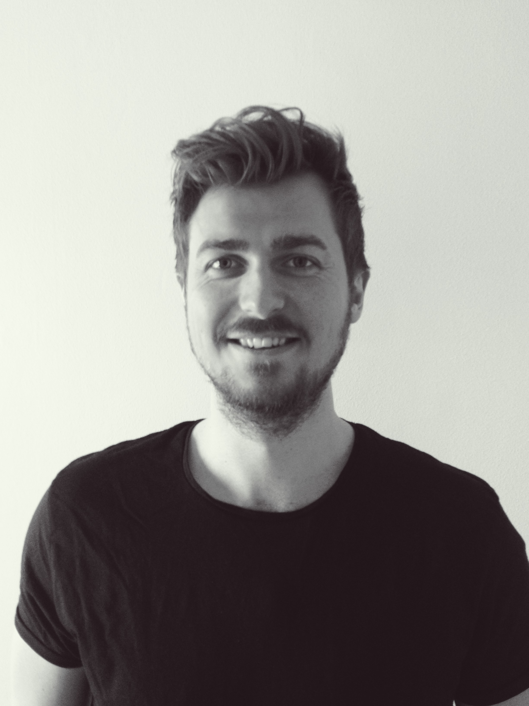

# Dagbok för Förnamn Efternamn

OSPP (1DT096) 2016 - Grupp 08

## Vecka 15

##### Måndag

##### Tisdag

##### Onsdag
**08:00-15:00**
Jobba med muntliga projektpresentation
##### Torsdag
**10:00-12:00**
Förberedelse ovh öva inför muntliga presentation 
**13:00-16:00**
Presentation av projektförslagen 
**22:00-00:00**
Jobba med den skriftliga projektpresentationen

##### Fredag
**10:00-12:00**
Slutföra skriftliga projektpresentationen

## Vecka 16

##### Måndag 
**12:00-15:30**
Gruppkontrakt,Påbörja admin på github(medlemmar.md etc)
##### Tisdag
**09:00-12:45**
Projektspec,reflektion,peer-review
##### Onsdag
**10:00-15:25**
Fortsättning peer-review, bestämma vad alla ska jobba med tills nästa vecka, möte med handledare 
**19:00-21:00** 
Tutorials i GO, fixa till emacs att kunna hantera GO. Resarch testing i GO
##### Torsdag
**13:15-17:00**
Påbörja uppdelning av arbete, försöka bryta ner vad som ska göras i vilken del.  
Dela upp gruppen och påbörja implementera den interna kommunikationen i servern
##### Fredag
**10:00-14:30**
Fortsätta jobba med interna kommunikationen för att nå milstolpe 1.  
Ingen bra dag då det dubbeljobbas för att delar av gruppen inte håller sig till uppdelningen 
Interna kommunikation klar för milstolpe 1. Påbörjar att bryta ner interna komm. ytterligare får att göra  
det enklare för senare i projektet
#### Lördag

## Vecka 17

##### Måndag

##### Tisdag

##### Onsdag

##### Torsdag

##### Fredag

## Vecka 18

##### Måndag

##### Tisdag

##### Onsdag

##### Torsdag

##### Fredag

## Vecka 19

##### Måndag

##### Tisdag

##### Onsdag

##### Torsdag

##### Fredag

## Vecka 20

##### Måndag

##### Tisdag

##### Onsdag

##### Torsdag

##### Fredag

## Vecka 21

##### Måndag

##### Tisdag

##### Onsdag

##### Torsdag

##### Fredag

## Vecka 22

##### Måndag

##### Tisdag

##### Onsdag

##### Torsdag

##### Fredag
