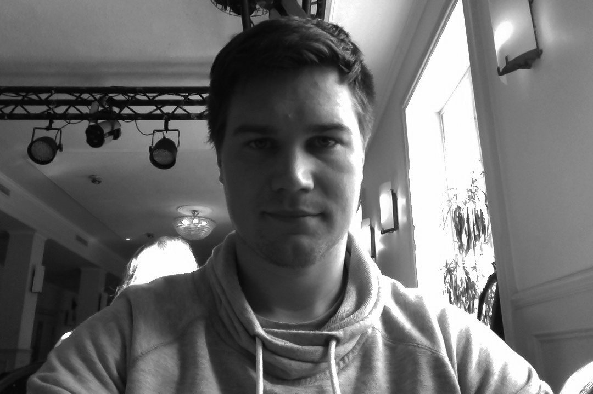

# Dagbok för Peter Berglund

OSPP (1DT096) 2016 - Grupp 08

## Vecka 15

##### Måndag

##### Tisdag

##### Onsdag
Arbetstid: 7h Arbete med projektförslag
##### Torsdag
Arbetstid: 3h Reptition av projektförslag + redovisning as projektförslag 
##### Fredag
Arbetstid: 3h Rapportskrivning projektförslag

## Vecka 16

##### Måndag
Arbetstid: 4h Meta administration och gihubstrul. Fått allt och funka tillslut!!!
##### Tisdag
Arbetstid:: 4h Skrivit projektspec, peer-review samt personlig reflektion 
##### Onsdag
Arbetstid: 5h fortsatt peer-review, påbörjat strukturering av arbetet och delat upp arbetet inom gruppen. möte med handledare. Ha en fungerande kommunication är satt som milstolpe 1.
##### Torsdag
Arbetstid: 4h Jobbat med intern kommunication.
##### Fredag
Arbetstid: 5h. Fortsatt arbete med kommunication.  

## Vecka 17

##### Måndag
Arbetstid: 5h. Workshop med Aletta. Förberedelelse och annan admintjänst inför progress meeting 1
##### Tisdag
Arbetstid: 3h. Förberedelse för progress meeting 1 
##### Onsdag
Arbetstid: 3h. Förberedelse för progress meeting 1 / genomfört progress meeting 1 / sista touch på projektförslagsrapporten
##### Torsdag

##### Fredag

## Vecka 18

##### Måndag

##### Tisdag

##### Onsdag

##### Torsdag

##### Fredag

## Vecka 19

##### Måndag

##### Tisdag

##### Onsdag

##### Torsdag

##### Fredag

## Vecka 20

##### Måndag

##### Tisdag

##### Onsdag

##### Torsdag

##### Fredag

## Vecka 21

##### Måndag

##### Tisdag

##### Onsdag

##### Torsdag

##### Fredag

## Vecka 22

##### Måndag

##### Tisdag

##### Onsdag

##### Torsdag

##### Fredag
